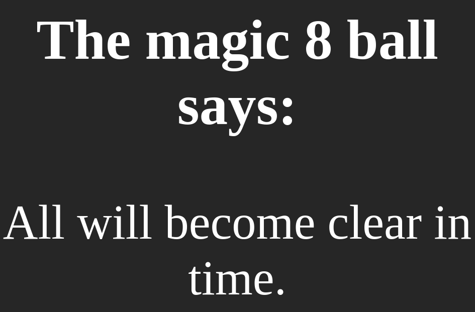

# gen8 - A web based fortune teller

## About

gen8 is a simple [Flask][flask] app which loads a series of fortunes from a
local text file named `messages.txt`.  It then uses [server sent
events][moz-sse] stream these updates to a client.



## Design

This application consists of two basic components:

  - Front end application which serves fortunes, along with relevant static
    assets
  - Back end application which reads the fortunes from a file and pushes them to
    the front end component.

The back end component is located in the file `gen8/__init__.py`, the front end
pieces are stored in `gen8/templates/` and `gen8/static/` respectively.

## Installation

Installing this application may be completed by installing the relevant Python
modules (which should be relegated to components in the standard library and
[Flask][flask]) via pip:

```sh
pip install -r requirements.txt
```

In general, it is likely best to do this in a Python virtualenv.

## Running

As this is a [Flask][flask] application it can be started as follows:

```sh
export FLASK_APP=gen8
flask run
```

[flask]:  https://www.palletsprojects.com/p/flask/
[moz-sse]: https://developer.mozilla.org/en-US/docs/Web/API/Server-sent_events

<!--
# vim: ts=2 sw=2 et tw=80
-->
